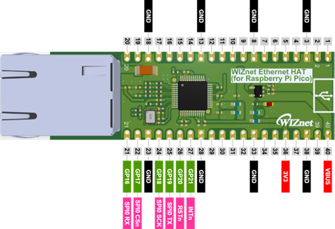
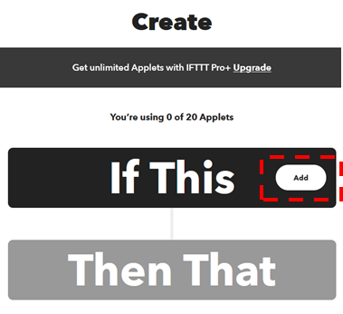
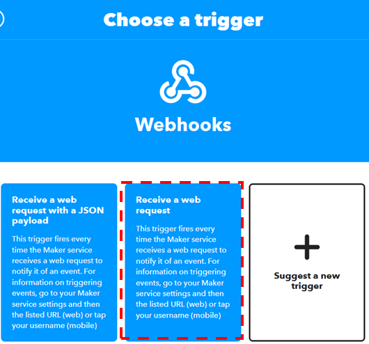
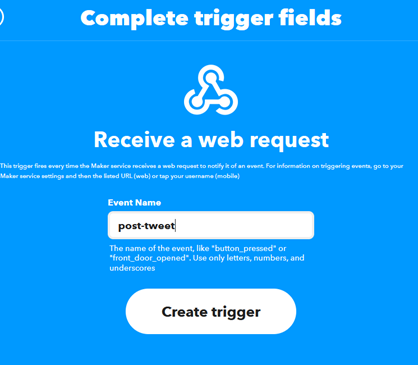
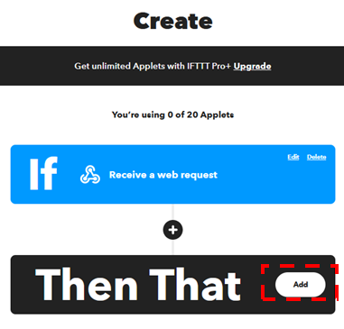
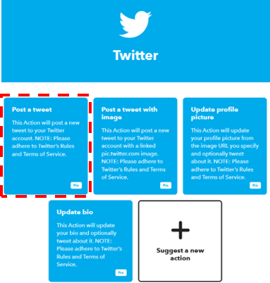
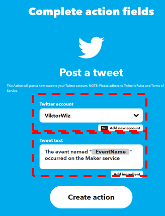
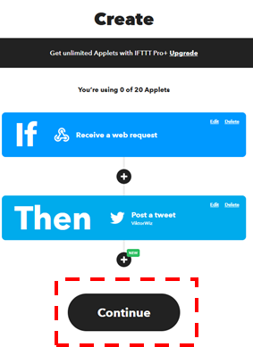
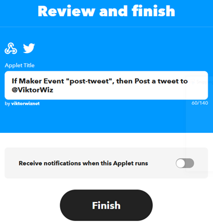
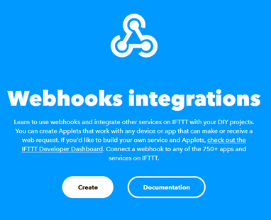

# W5100S-RP2040-IFTTT-Twitter-Example

This projects aims to guide how to connect Rpi Pico to Twitter with help of WIZnet Ethernet HAT, IFTTT and Micropython 

# How to Connect Raspberry Pi Pico to Twitter using Ethernet HAT and IFTTT

## 1. Introduction

To continue my micropython journey started in previous [project](http://maker.wiznet.io/viktor/projects/ble%2Dto%2Dethernet%2Dcentral/), this time I decided to try connecting Raspberry Pi Pico and Twitter using WIZnet Ethernet HAT and Micropython.

As WIZnet Ethernet HAT is designed to be pin-compatible with Raspberry Pi Pico, connecting these boards is simple. For more details about the board, refer to [docs page](http://docs.wiznet.io/Product/Open-Source-Hardware/wiznet_ethernet_hat) and [youtube video](https://www.youtube.com/watch?v=RTyaJc1gNrg)



| Pico Pin  | Description  |
| --------- | ------------ |
| GPIO16 | Connected to MISO on W5100 |
| GPIO17 | Connected to CSn on W5100S |
| GPIO18 | Connected to SCLK on W5100S |
| GPIO19 | Connected to MOSI on W5100S |
| GPIO20 | Connected to RSTn on W5100S |
| GPIO21 | Connected to INTn on W5100S |

Please note that this project can be replicated using W5100S-EVB-Pico or W5500-EVB-Pico boards. In this case you can skip 3rd step with "Customizing Micropython firmware".

## 2. Setup IFTTT

IFTTT, or If This, Then That, acts as the bridge connecting Raspberry Pi Pico to Twitter. It's a free service that facilitates the integration of various data services. I'll create an applet that responds to a webhook, sending data to IFTTT. Subsequently, IFTTT will include this data in a message sent to Twitter.

* Visit [IFTTT](https://ifttt.com/explore), create account and login

* Click "Create" button


* Click on "Add" button to create a trigger event.



* Search for "webhook" and click on the tile


* Select "Receive a web request"



* Create an Event name and press "Create trigger" button



* "If" is now configured, now let's set "Then That". Click "Add"



* Type "Twitter" in the search bar and click on the icon


* Select "Post a tweet"



* Type in your Twitter account (make sure it is correct). Customize your tweet text, press "Add ingredient" to add variable



* Click "Continue" button



* Review the applet, toggle the button to opt in for notifications and click "Finish" button



* Visit [webhook](https://ifttt.com/maker_webhooks) page and click "Documentation" button



* Copy the post link.

```
https://maker.ifttt.com/trigger/{event}/json/with/key/YOUR API KEY HERE
```

Remove/json, change {event} to your trigger name (in my case "post-tweet") and insert your API key.

```
https://maker.ifttt.com/trigger/post-tweet/with/key/YOUR API KEY HERE
```

## 3. Custom Micropython firmware

As I am using Raspberry Pi Pico, the basic Micropython firmware doesn't have WIZNET5K library. Therefore I need to build a firmware that would contain this library.

Disclaimer: It is my second time using Micropython, there might be better and easier way to add network library to Pico. Below changes are effective as of July 2023.

* Clone micropython repository
* Navigate to "ports/rp2/boards/PICO" folder and make following changes
* In mpconfigboard.h add

```c
// Board and hardware specific configuration
#define MICROPY_HW_BOARD_NAME                   "Raspberry Pi Pico"
#define MICROPY_HW_FLASH_STORAGE_BYTES          (1408 * 1024)

#define MICROPY_PY_NETWORK                      (1)
```
* In mpconfigboard.cmake add
```c
# cmake file for Raspberry Pi Pico

set(MICROPY_PY_NETWORK_WIZNET5K W5100S)
set(MICROPY_PY_LWIP 1)
set(MICROPY_FROZEN_MANIFEST ${MICROPY_BOARD_DIR}/manifest.py)
```
* Create new manifest.py file and copy following
```c
include("$(PORT_DIR)/boards/manifest.py")

require("bundle-networking")
```
*  Build and flash firmware to the Pico board

## 4. The code

* Import modules and libraries
```python
from usocket import socket
from machine import Pin,SPI
import network
import time
import urequests
```

* Initialize WIZnet chip. In my case I used static IP, make sure to update according to your environment.

```python
#W5x00 chip init
def w5x00_init():
    spi=SPI(0,2_000_000, mosi=Pin(19),miso=Pin(16),sck=Pin(18))
    nic = network.WIZNET5K(spi,Pin(17),Pin(20)) #spi,cs,reset pin
    nic.active(True)
    nic.ifconfig(('192.168.11.30','255.255.255.0','192.168.11.1','8.8.8.8'))
    while not nic.isconnected():
        time.sleep(1)
        print(nic.regs())
    print(nic.ifconfig())
```

* Post the message to Twitter using the urequests.post

```python
message = "https://maker.ifttt.com/trigger/post-tweet/with/key/YOUR_API_KEY_HERE?value1=Hello%20World"
urequests.post(message)
```

The complete code:
```python
from usocket import socket
from machine import Pin,SPI
import network
import time
import urequests

#W5x00 chip init
def w5x00_init():
    spi=SPI(0,2_000_000, mosi=Pin(19),miso=Pin(16),sck=Pin(18))
    nic = network.WIZNET5K(spi,Pin(17),Pin(20)) #spi,cs,reset pin
    nic.active(True)
    nic.ifconfig(('192.168.11.30','255.255.255.0','192.168.11.1','8.8.8.8'))
    while not nic.isconnected():
        time.sleep(1)
        print(nic.regs())
    print(nic.ifconfig())
        
def main():
    w5x00_init()

    message = "https://maker.ifttt.com/trigger/post-tweet/with/key/YOUR_API_KEY_HERE?value1=Hello%20World"
    urequests.post(message)
    
if __name__ == "__main__":
    main()
```
**Note:** IFTTT has a rate limit of 25 tweets per day, so make sure to add sleep interval when posting in a loop

## 5. Result

After running the code, you will get an email from IFTTT (if opted for notifications) and see the corresponding post in your Twitter account.


## 6. Next plan

I might use this to automate my SNS posting. Stay tuned for next project :)